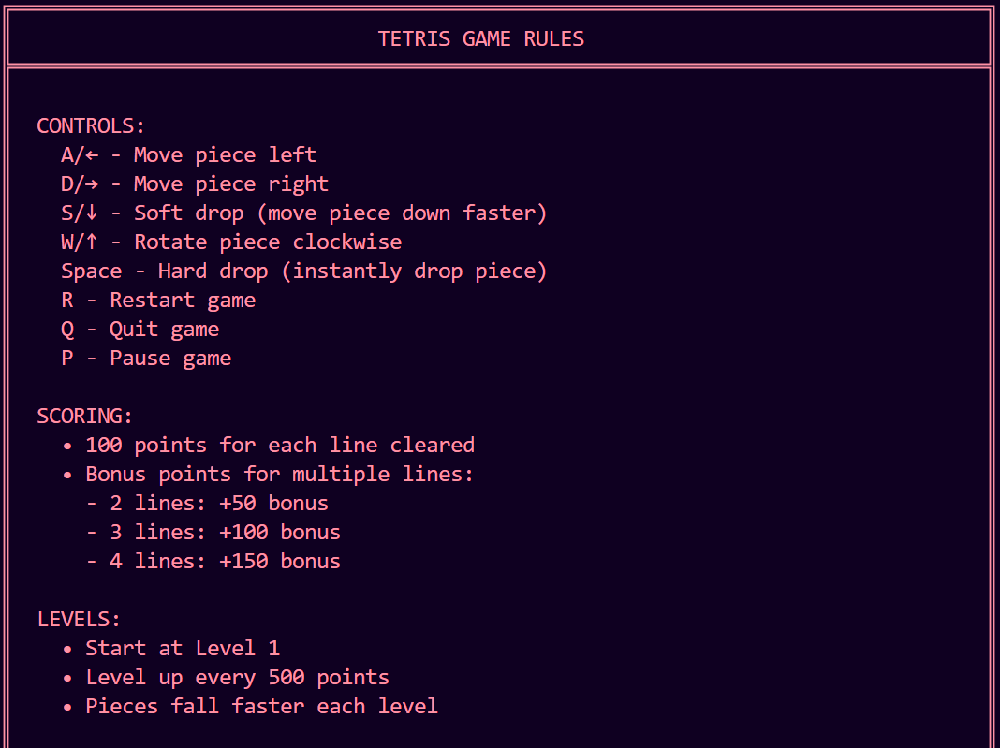

# Cross-Platform Tetris Game

A classic Tetris implementation written in C++ that works on both Windows and Unix-based systems.




## Features

- 🎮 Full-featured Tetris gameplay
- 🌈 Colorful emoji block display
- 🔄 Next piece preview
- 📊 Score tracking with high score persistence
- ⏫ Progressive difficulty with increasing levels
- ⌨️ Intuitive keyboard controls
- 🖥️ Cross-platform compatibility (Windows, Linux, macOS)
- ✨ Line clear animations and bonus effects

## Controls

- **A/←**: Move piece left
- **D/→**: Move piece right  
- **S/↓**: Soft drop (move piece down faster)
- **W/↑**: Rotate piece clockwise
- **Space**: Hard drop (instantly drop piece)
- **R**: Restart game
- **Q**: Quit game
- **P**: Pause/unpause game

## Scoring System

- 100 points for each line cleared
- Bonus points for multiple lines:
  - 2 lines: +50 bonus
  - 3 lines: +100 bonus
  - 4 lines: +150 bonus
- Level increases every 500 points
- Game speed increases with each level

## Building and Running

### Prerequisites
- C++ compiler (GCC, Clang, or MSVC)
- Standard C++ libraries

### Windows
```
g++ Tetris_Game.cpp -o tetris.exe
./tetris.exe
```

### Linux/macOS
```
g++ Tetris_Game.cpp -o tetris
./tetris
```

## Technical Details

- Uses standard C++ libraries and minimal platform-specific code
- Cross-platform compatibility maintained using conditional compilation
- Terminal-based gameplay with Unicode emoji blocks
- Non-blocking keyboard input handling
- Game state persistence for high scores

## Implementation Notes

The game implements several cross-platform utilities:
- Console screen manipulation (clear screen, cursor positioning)
- Non-blocking keyboard input detection
- Unicode/emoji support for visual elements
- Timing mechanisms for piece movement and animations

## Contributing

Contributions are welcome! Here are some ideas for improvements:

- Add hold piece functionality
- Implement T-spin and other advanced move recognition
- Add local multiplayer mode
- Create a graphical version using SDL or SFML
- Add sound effects and music

## License

This project is licensed under the MIT License - see the LICENSE file for details.

## Acknowledgments

- Original Tetris game created by Alexey Pajitnov in 1984
- Inspired by various terminal-based game implementations
